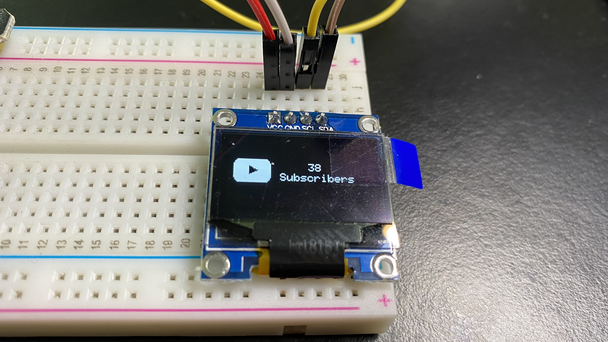

# yt-subscriber-count

A display to show current Youtube Channel Subscriber number.
# Step by Step Guide and Demo Video (Video Spoken in Mandarin)

# Hardwares
- ESP-01S (ESP8266)
- ESP-01 USB Programmer with CH340C
- 0.96 inch OLED display
- YwRobot Power mb v2
- Breadboard
- Jumper wires
- 9V Power Adapter
# Softwares to Install
- CH340C Driver
- Arduino IDE
# Dependencies
- Adafruit_SSD1306
- Adafruit_GFX
- Arduino YouTube API
- Arduino Json
- Get Api Key by Enable Youtube Data API in Google Cloud
# References
- [YouTube Subscriber Counter (Under 10K)](https://www.instructables.com/YouTube-Subscriber-Counter-With-ESP8266/)
- [Interface OLED Graphic Display Module with Arduino](https://lastminuteengineers.com/oled-display-arduino-tutorial/)
- [ESP8266 0.96 inch OLED Display with Arduino IDE](https://randomnerdtutorials.com/esp8266-0-96-inch-oled-display-with-arduino-ide/)
- [Display Images in OLED Display](https://diyusthad.com/2019/02/display-images-in-oled-display.html)
- [ESP8266 Arduino Doc](https://github.com/esp8266/Arduino/blob/master/doc/libraries.rst#i2c-wire-library)
- [YouTube logo](https://pixabay.com/illustrations/youtube-red-social-icon-play-1495277/)
